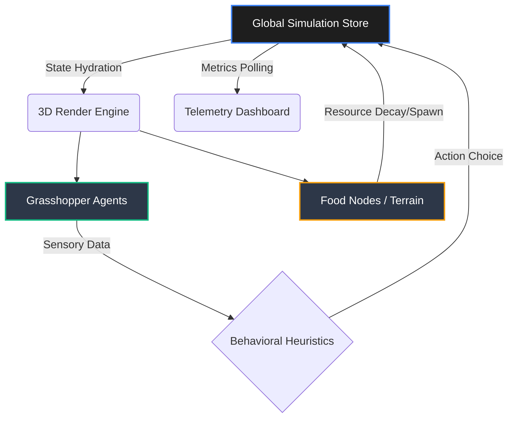
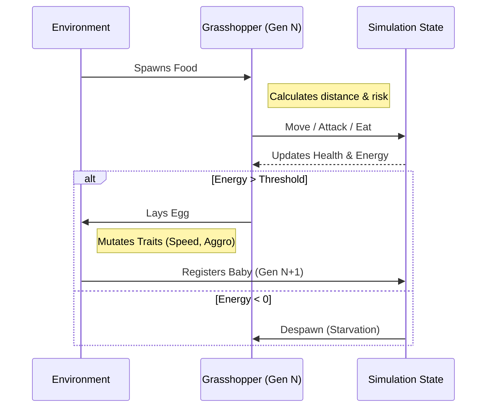

# GrasshopperSim

**An Evolutionary Sandbox & Game Theory Visualizer**

[](#)
[](#)
[](#)
[](#)

*A WebGL-powered ecosystem where artificial lifeforms inherit traits, compete for resources, and showcase emergent behavioral strategies over generations.*

---

## 🧬 Theoretical Foundation

GrasshopperSim is not just a visualizer; it is an interactive laboratory exploring the fundamental mechanics of **Evolutionary Algorithms** and **Game Theory**.

### The Evolutionary Engine

Agents in the simulation possess a discrete genome composed of continuous traits:

- **`speed`**: Energy expenditure rate vs. resource acquisition potential.
- **`jumpDistance` & `jumpHeight`**: Physical locomotion strategies.
- **`aggressiveness`**: The propensity to engage in combative interactions over resources.

Through continuous time simulation, agents that secure sufficient resources (`health`) live long enough to pass their optimized trait matrices down to the next `generation`.

### Game Theory in Action: The Hawk-Dove Dynamic

The simulation organically manifests the classic **Hawk-Dove game**. When two agents compete for the same food node, their `aggressiveness` trait dictates the encounter:

- High-aggressiveness ('Hawks') risk fatal damage but gain a monopoly on resources.
- Low-aggressiveness ('Doves') share or flee, ensuring survival but missing optimal energy gains.
Over time, the population approaches an Evolutionary Stable Strategy (ESS), visible in real-time through the metrics dashboard.

---

## 🏗️ System Architecture

Our engine decouples the reactive UI from the dense physics simulation, ensuring stable 60FPS updates even at high population counts.



### The Life Cycle Loop



---

## 🚀 Getting Started

### Local Deployment

Ensure you have Node.js and `npm` installed.

```bash
# Clone the repository
git clone https://github.com/yourusername/grasshoppersim.git

# Install dependencies
npm install

# Instigate the simulation
npm run dev
```

### Build for Production

To bundle the WebGL canvas and React bundle into a unified, high-performance static build:

```bash
npm run build
npm run preview
```

---

## 📊 Telemetry & Observation

The environment heavily features real-time metric tracking via `recharts` and `echarts-gl`:

- **Population Velocity**: Track rapid birth/death spikes in response to environmental carrying capacity constraints.
- **Trait Drift**: Graph average speeds and jump heights as the environment applies selective pressure.
- **Generational Lineage**: Track the longest surviving family names natively generated via the engine.

> **Note:** The simulation state is volatile. Custom logic limits rapid changes to enforce evolutionary limits mathematically.
